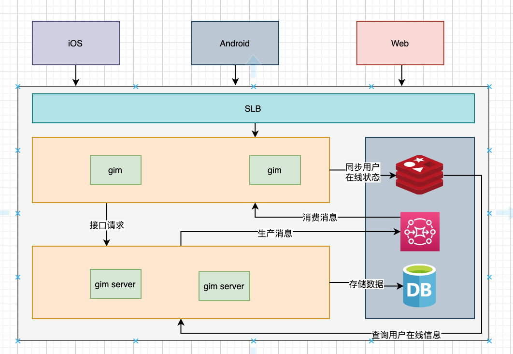

# gim

#### gim是由go编写的im服务，支持tcp websocket两种方式, tcp使用gnet库

#### 支持单聊、群聊、聊天室、全服广播

#### 协议定义
|version|cmdId|bodyLen|body|
|---|---|---|---|
|1字节|1字节|2字节|最多64KB|
|uint8|uint8|uint16|bytes|
|最多可以支持256个协议版本|最多支持256种指令|最多支持到65535||

##### 对消息设计上使用写扩散的方式保存消息，保证消息可靠性。最大支持1000人群，所有消息全部先落主库，再落收件箱，然后通知客户端来进行拉取。只有推送和全服广播是直接推送给客户端（后期为了监控下发情况，可以通过保存客户端的ack情况来分析推送和全服广播的下发情况）

#### 整体设计如下

